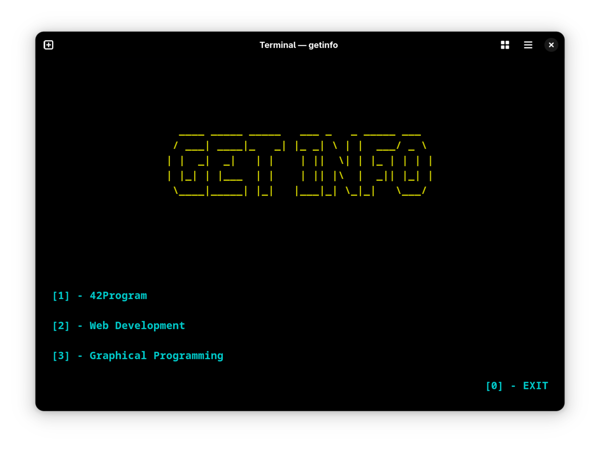
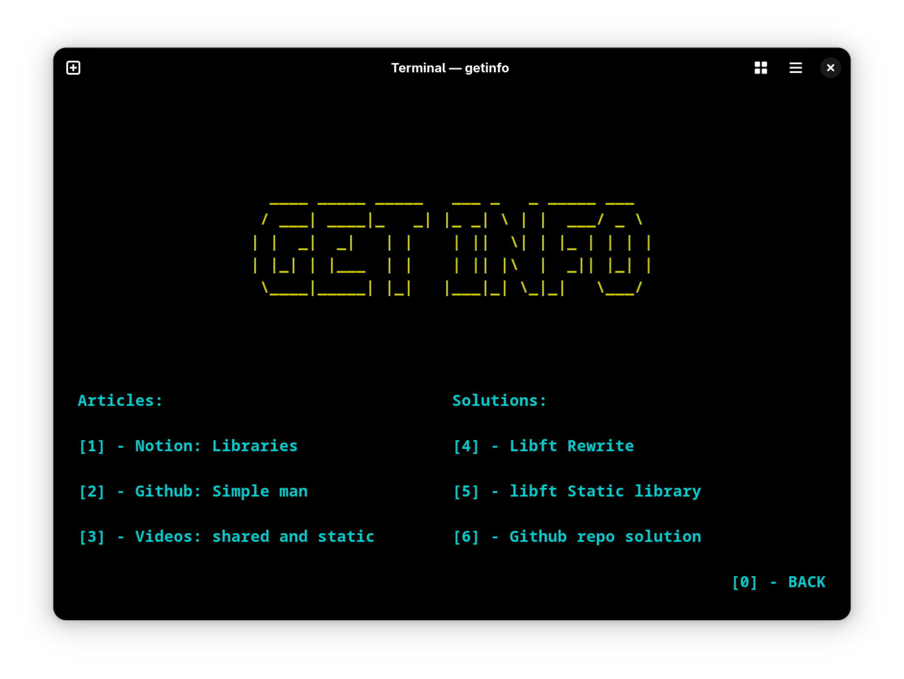

# GET-INFO
## GET-INFO is a simple TUI (Text-based User Interface) tool that provides quick and easy access to some good resources, all from your terminal.


### Features
- Clean terminal interface
- Quick access to curated resources
- Keyboard-driven navigation

### Installation

```bash
git clone https://github.com/out-0/getinfo.git
cd getinfo
make
sudo cp getinfo /usr/local/bin
```
"Now you can run getinfo from anywhere in your terminal"

### Usage

```bash
getinfo
```
| Menu View | Links View |
|-----------|------------|
|  |  |
|   |  |


### Preview


